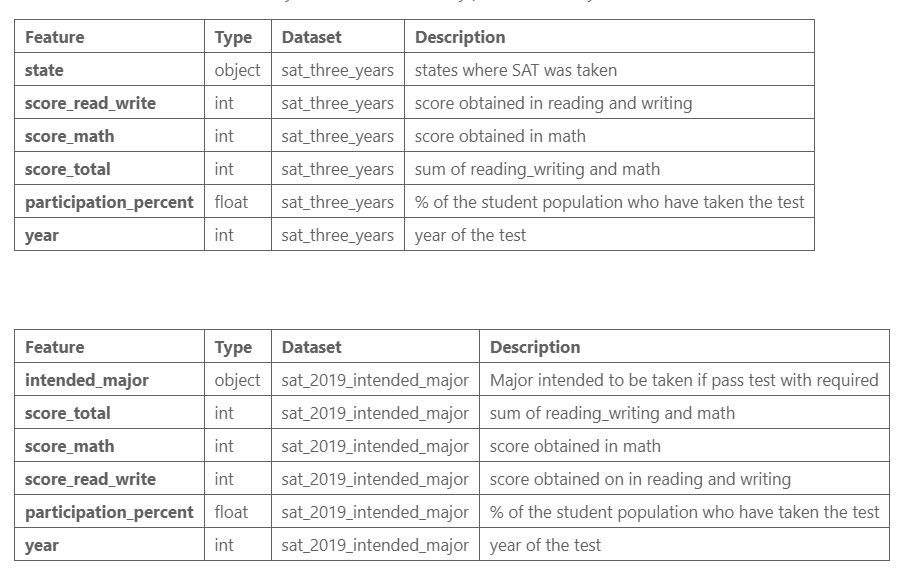
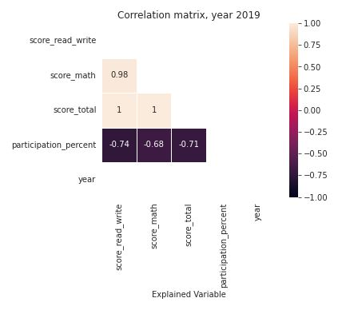
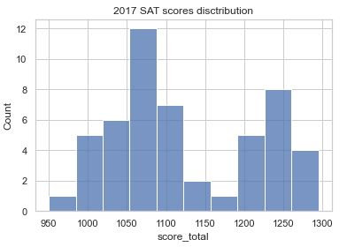

# README - Project 1 - Standardized Test Analysis

## Introduction to and overview

### Introduction

In this project, we have chosen to focus on SAT scores and analyze patterns over 2017,2018,2019. We also added the "intended college major 2019".

The resources provided are already agregated at state level, so the granularity of the data in hand in low, and the conclusions are high level

After reading from multiple sources about the pros and cons of standardized test, we understance that each state has a policy ( for / against ) standardized testing. Colleges on their side also have a say in whether they require SAT/ACT scores, or if they make it optional for the candidate to submit

*https://www.washingtonpost.com/education/2019/03/19/is-it-finally-time-get-rid-sat-act-college-admissions-tests/*

*https://www.theatlantic.com/ideas/archive/2022/04/mit-admissions-reinstates-sat-act-tests/629455/*

*https://www.testgeek.com/blog/a-look-at-the-average-sat-score-by-state/*

The problem statement is :

**"Does looking at SAT scores averages per state paints a correct picture of academic performance for a given state?"**

### Overview

After running the EDA and coming up with 2 dataframes structured like these:

we continued on to visualize the data:

We observed a strong correlation between scores and participation percentage for each year of the analysis.

We also a distribution with 2 peaks, indicating 2 groups of states, the "1075 average " and the  "1250 average"

We also observed that participation level for each state does not significantly change year over year, and their score level would also remain constant.

Upon completing our EDA, we realized that the "intended_college_major file" will not add value to our analysis, so we park for the vizualisation part.

### Conclusion

After visualizing SAT scores from 2017-2019, **we conclude that the SAT score in a given state in not a predictor of academic success** **for students in this state**. 

States that do not enforce taking SAT seem to **end up with selection biais of only teir best students taking it and hence - scoring high**.

We do not have data for the remainder of the students not taking SAT, **hence we cannot conclude on state-level academic performance.**

It would be interesting to cross this data with student social background, future occupation, earnings to explore **how a score test can (or not) predict someone's future in a given state**
